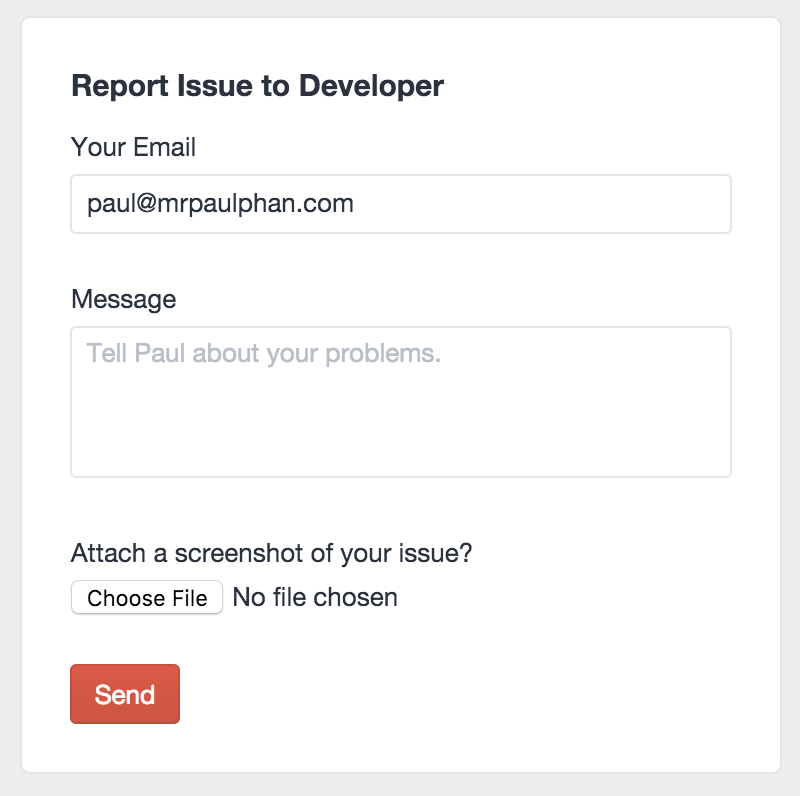

# Contact Developer plugin for Craft
A dashboard widget for CraftCMS that will allow the client to contact you from the dashboard with any issues after handoff.

#Installation
To install Contact Developer, follow these steps:

1. Upload the contactdeveloper/ folder to your craft/plugins/ folder.
2. Go to Settings > Plugins from your Craft control panel and enable the Contact Developer plugin.
3. Go to your dashboard and click on "+New Widget" and select "Contact Developer".
4. Finished!

#Licence
Copyright 2015 MrPaulPhan
